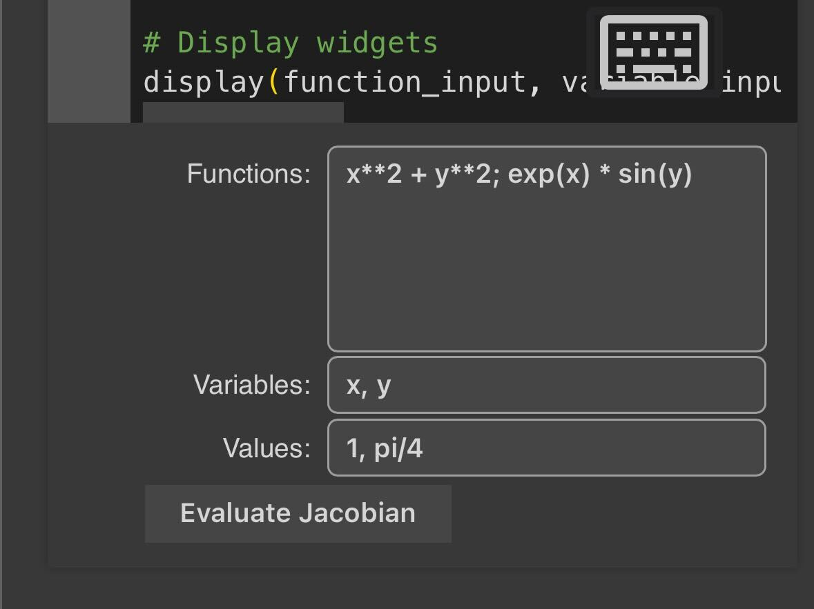

# Jacobian Calculator

This repository contains a Jacobian Calculator implemented in Python for use in Jupyter Notebooks or Google Colab. The calculator allows users to input functions, variables, and specific evaluation points to compute and visualize the Jacobian matrix.

## Features

- Calculation of the Jacobian matrix for a given set of functions and variables.
- Visualization of the Jacobian matrix as a heatmap for easier interpretation.
- Interactive input widgets for user-friendly operation.

## Usage

To use the Jacobian Calculator:

1. Open the `Jacobian-Calculator.ipynb` in Google Colab or a Jupyter environment.
2. Enter your functions, variables, and the points of evaluation into the respective fields.
3. Click the "Evaluate Jacobian" button to compute and display the Jacobian matrix and its heatmap visualization.

### Input Fields

- **Functions**: Enter the functions separated by semicolons.
- **Variables**: Enter the variable names separated by commas.
- **Values**: Enter the numerical values for the variables separated by commas.

## Example

Here's an example of the calculator in use:



In this example, the functions `x**2 + y**2` and `exp(x) * sin(y)` are evaluated at `x = 1, y = π/4`.

## Requirements

- Python 3.x
- NumPy
- Matplotlib
- Seaborn
- SymPy
- TensorFlow (optional, for TensorFlow-compatible functions)
- ipywidgets (for interactive input)

## Installation

```bash

To open this project in an interactive environment with Google Colab, click the following button:
```
[](https://colab.research.google.com/github/LoQiseaking69/Jacobian-calculator/blob/main/Jacobian-Calculator.ipynb)


You can clone this repository or download the `.ipynb` file directly to your local machine. If you're using Google Colab, you can open the notebook directly from GitHub or upload the `.ipynb` file.

## Contributing

Contributions to the Jacobian Calculator are welcome! Please feel free to submit pull requests or open an issue if you have suggestions or find a bug.

## License

This project is open-source and available under the MIT License.
